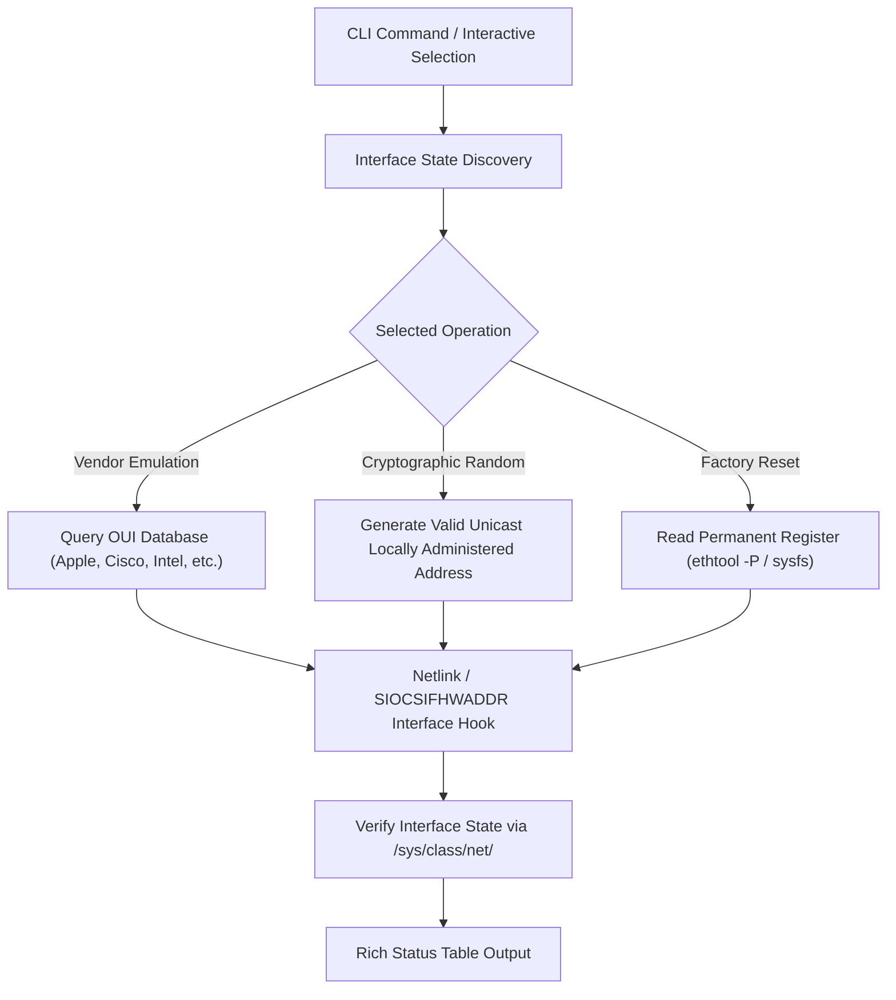

# 🎭 SpoofX — Linux Network Interface MAC Address Anonymizer

[](https://python.org)
[](https://kernel.org)
[](https://github.com/Textualize/rich)
[](https://kernel.org)
[](LICENSE)

**SpoofX** is a fast, low-level Linux networking utility for changing, randomizing, and restoring hardware MAC addresses on physical and virtual network interfaces.

Equipped with authentic IEEE Organizationally Unique Identifier (OUI) vendor emulation (Apple, Cisco, Intel, Dell, HP, Samsung, VMware) to audit captive portal bypasses and Network Access Control (NAC) filtering, alongside reliable permanent hardware recovery via `ethtool` and sysfs registers.

---

## ⚡ Key Capabilities

- 🏢 **Authentic OUI Vendor Emulation:** Generates valid hardware manufacturer prefixes to assess captive portals, Wi-Fi access controllers, and MAC whitelist filtering.
- 🎲 **Cryptographically Compliant Randomization:** Creates valid IEEE unicast, locally-administered MAC addresses without risking multicast or broadcast collision.
- 🔄 **100% Guaranteed Hardware Recovery:** Queries permanent hardware registers (`ethtool -P`) to restore factory MAC addresses without requiring device reboots.
- 📊 **Interface Inspection Matrix:** Inspects physical (`eth0`, `wlan0`) and virtual (`docker0`, `tun0`) adapters, comparing active vs permanent hardware states in real time.

---

## 🏗️ Operational Flow



---

## 🚀 Quick Start

### 1. Installation
```bash
git clone https://github.com/Mr-N1ck/spoofx.git
cd spoofx
pip install rich
```

### 2. Common Operations

```bash
# View interface status table without root
python3 mac_spoofer.py --show

# Randomize MAC address on eth0
sudo python3 mac_spoofer.py -i eth0 -r

# Emulate specific manufacturer vendor
sudo python3 mac_spoofer.py -i eth0 -v apple
sudo python3 mac_spoofer.py -i wlan0 -v cisco

# Restore factory permanent hardware MAC
sudo python3 mac_spoofer.py -i eth0 --reset

# Interactive menu mode
sudo python3 mac_spoofer.py
```

---

## 💻 CLI Flags

| Flag | Description |
| :--- | :--- |
| `-s, --show` | Display status table of all network interfaces without needing root |
| `-i, --interface <name>` | Target network interface (e.g. `eth0`, `wlan0`) |
| `-r, --random` | Generate and apply a random unicast MAC address |
| `-v, --vendor <name>` | Emulate vendor OUI (`apple`, `cisco`, `intel`, `dell`, `hp`, `samsung`, `vmware`) |
| `-m, --mac <address>` | Assign a specific custom MAC address (`aa:bb:cc:dd:ee:ff`) |
| `--reset` | Revert interface back to permanent factory hardware address |

---

## 🎥 Proof of Concept & Verification

> **Note:** Terminal logs and interface state transition recordings are documented in [`docs/`](docs/) and [`poc/`](poc/).

<!-- User Demo Placement Zone -->
```
[ Drop your demo.gif or demo.mp4 recording here: docs/demo.gif ]
```

---

## ⚖️ Legal & Ethical Notice

SpoofX is provided for authorized wireless and network security auditing, privacy research, and educational testbeds. Unauthorized alteration of hardware identifiers on enterprise networks without permission is subject to organizational and legal penalties.

**Author:** Prince Gaur ([LinkedIn](https://www.linkedin.com/in/mr-n1ck/) · [GitHub](https://github.com/Mr-N1ck))
